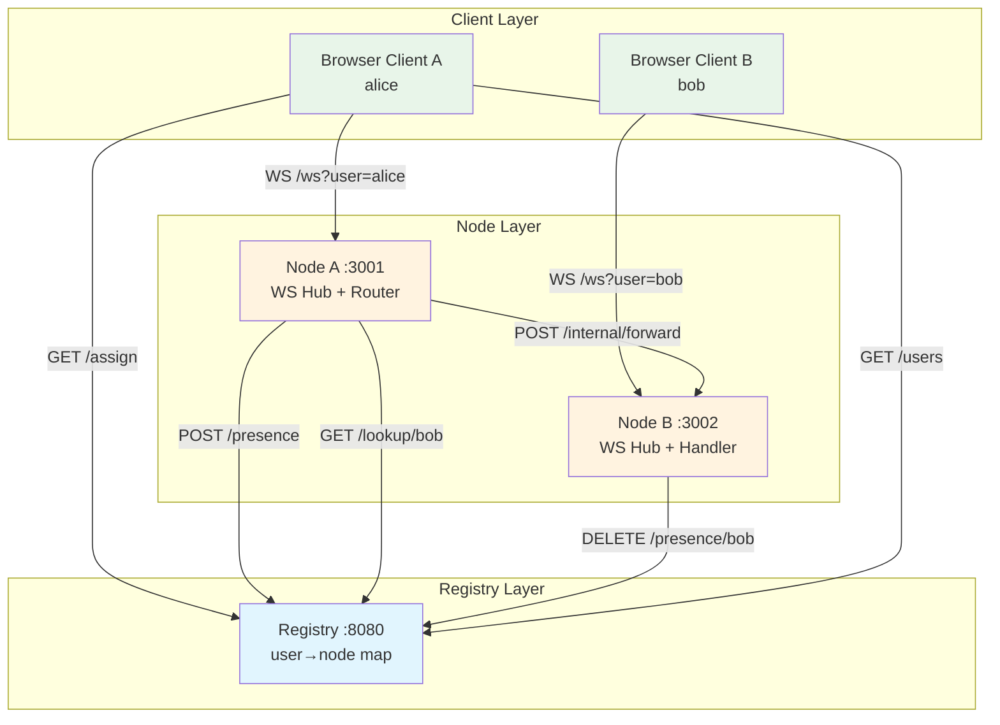

# Central Registry — Distributed WebSocket Chat

A production-oriented reference implementation of the **Central Registry Pattern**: a chat system where a lightweight registry discovers which node hosts each online user, and nodes forward cross-node messages via HTTP.

---

## Getting Started

### Prerequisites

- **Docker** and **docker-compose** (for containerized run)
- **Go 1.25+** (for local run without Docker)
- A static file server for the client (optional if using Docker — the client is served automatically via nginx)

### Run with Docker (Quick Start)

```bash
git clone <repository-url>
cd central-registry
docker compose up --build -d
```

The application will be available at:
- **Registry API**: http://localhost:8080
- **Node A** (client-facing): http://localhost:3001
- **Node B** (client-facing): http://localhost:3002
- **Chat Client**: http://localhost:8081

To view logs: `docker compose logs -f`
To stop and remove containers: `docker compose down`

> The included **`run-docker.sh`** script performs a full rebuild and restart:
> ```bash
> bash run-docker.sh
> ```

### Run Locally (Without Docker)

1. **Start the registry**:
   ```bash
   cd registry && go run main.go
   ```

2. **Start two nodes** (in separate terminals):
   ```bash
   NODE_ID=node-a NODE_ADDR=http://localhost:3000 CLIENT_ADDR=http://localhost:3001 REGISTRY_URL=http://localhost:8080 PORT=3001 go run main.go
   NODE_ID=node-b NODE_ADDR=http://localhost:3000 CLIENT_ADDR=http://localhost:3002 REGISTRY_URL=http://localhost:8080 PORT=3002 go run main.go
   ```

3. **Serve the client** (any static file server on port 8081):
   ```bash
   cd client && python3 -m http.server 8081
   # or: npx serve -l 8081
   ```

4. Open your browser at `http://localhost:8081` and start chatting!

---

## Project Overview

Users connect through a browser client, are assigned to a chat node via round-robin, and can send messages to any other online user — even if that user lives on a different node. The registry is the single source of truth for `user_id → node` mappings. No database is used; all routing state is in-memory.

| Role | Language | Port | Responsibility |
|------|----------|------|----------------|
| **Registry** | Go | 8080 | Node registration, presence tracking, user lookup, round-robin assignment |
| **Chat Node** | Go | 3000+ (3001, 3002 …) | WebSocket hub, message routing, cross-node forwarding |
| **Client** | HTML/JS | 80 (served via Docker/nginx) | UI, WebSocket client, user discovery, local message persistence |

---

## High-Level Architecture

```
┌─────────────┐                         ┌─────────────┐
│  Client 1   │                         │  Client 2   │
│  (alice)    │                         │   (bob)     │
└──────┬──────┘                         └──────┬──────┘
       │ WebSocket                             │ WebSocket
       ▼                                       ▼
┌─────────────────┐                 ┌─────────────────┐
│    NODE A       │                 │    NODE B       │
│  (localhost:3001)│                │  (localhost:3002)│
│  WS Hub         │                 │  WS Hub         │
│  Registry Client│                 │  Registry Client│
│  Message Router │                 │  Message Handler│
└────────┬────────┘                 └────────┬────────┘
         │                                   │
         │   HTTP (lookup / forward)         │
         └────────────┬──────────────────────┘
                      ▼
            ┌─────────────────┐
            │   REGISTRY      │
            │  (localhost:8080)│
            │  user→node map  │
            └─────────────────┘
```

### Component Responsibilities

| Component | Responsibility |
|-----------|----------------|
| **Registry** | Maintains `map[user_id]NodeInfo`, round-robin node assignment, CORS middleware, health endpoint |
| **Node** | `Hub` manages WebSocket clients, `RegistryClient` reports presence, `Router` forwards cross-node messages, `HTTP handler` receives inbound forwards |
| **Client** | Single WebSocket connection, periodic `/users` refresh (30 s), manual refresh button, local `localStorage` message history |

---

## Architecture Diagram (Mermaid)



---

## Request / Data Flow

### 1. Connection & Assignment

```
Client                          Registry                      Node A
  │                               │                             │
  │── GET /assign?user_id=alice ─▶│                             │
  │◀── {address, node_id,         │                             │
  │     internal_address} ────────│                             │
  │                               │                             │
  │────── WS /ws?user=alice ─────▶│                             │
  │◀───── 101 Switching Protocols │                             │
  │                               │── POST /presence ──────────▶│
  │                               │◀── {success:true} ──────────│
  │◀── "connected" ack ───────────│                             │
```

1. Client calls `GET /assign?user_id=<id>` → registry returns `client_address` (for WS) + `internal_address` (for node-to-node).
2. Client opens WebSocket to `client_address/ws?user=<id>`.
3. Node calls `POST /presence {user_id, node_id}` to register the mapping.
4. Node pushes `{type:"connected"}` ack to client.

### 2. Local Delivery (same node)

```
Alice (WS) → Node A Hub → lookup clients["bob"] → deliverLocal → Bob (WS)
                                                      │
                                                      ▼
                                                ACK to Alice
```

- If recipient is in the node's `clients` map, message is delivered directly.
- Sender receives `{type:"ack", msg_id}` immediately.

### 3. Cross-Node Delivery

```
Alice (WS) → Node A → GET /lookup/bob → Registry → {node-b, addr}
                                           │
                                           ▼
Node A → POST /internal/forward → Node B → deliverLocal → Bob (WS)
                                      │
                                      ▼
                                ACK to Alice
```

1. Node A calls `GET /lookup/<to_user>` on registry.
2. Registry returns the target node's `address` (internal Docker address).
3. Node A `POST`s `ForwardMessage` to `{address}/internal/forward`.
4. Node B delivers to local WebSocket client.
5. Node A sends ACK to sender.

### 4. User Discovery

- Client polls `GET /users` on connect + every 30 s + manual refresh.
- Registry returns all online users with `node_id`, `internal_address`, `client_address`.

### 5. Disconnect & Cleanup

1. WebSocket read error → node removes client from `clients` map.
2. Node calls `DELETE /presence/<user_id>` on registry.
3. User disappears from `/users` and `/lookup`.

---

## API Reference

### Registry (`http://registry:8080`)

| Method | Endpoint | Description |
|--------|----------|-------------|
| POST | `/nodes/register` | Register a node `{node_id, address, client_address}` |
| POST | `/presence` | Report user online `{user_id, node_id}` |
| DELETE | `/presence/:user_id` | Remove user presence |
| GET | `/lookup/:user_id` | Get node info for a user |
| GET | `/nodes/list` | List all registered nodes |
| GET | `/users` | List all online users with full node info |
| GET | `/assign?user_id=` | Round-robin node assignment |
| GET | `/health` | Health check |
| OPTIONS | `*` | CORS preflight (204) |

### Node (`http://node-x:3000`)

| Method | Endpoint | Description |
|--------|----------|-------------|
| GET | `/ws?user=` | WebSocket upgrade |
| POST | `/internal/forward` | Receive cross-node forward `{to_user, from_user, content, msg_id, timestamp}` |
| GET | `/health` | Health check |

### WebSocket Protocol (Client ↔ Node)

**Client → Server**
```json
{ "type": "chat", "to": "bob", "content": "Hi!", "msg_id": "..." }
{ "type": "ping" }
```

**Server → Client**
```json
{ "type": "chat", "from": "alice", "content": "Hi!", "msg_id": "...", "timestamp": 1234567890 }
{ "type": "ack", "msg_id": "..." }
{ "type": "error", "error": "User not found" }
{ "type": "pong" }
```

---

## Data Model

```go
// shared/types.go

type NodeInfo struct {
    NodeID        string `json:"node_id"`
    Address       string `json:"address"`       // internal Docker address
    ClientAddress string `json:"client_address"` // external browser address
}

type ForwardMessage struct {
    MsgID     string `json:"msg_id"`
    FromUser  string `json:"from_user"`
    ToUser    string `json:"to_user"`
    Content   string `json:"content"`
    Timestamp int64  `json:"timestamp"`
}

type WSMessage struct {
    Type      string `json:"type"`        // chat | ack | error | ping | pong
    From      string `json:"from,omitempty"`
    To        string `json:"to,omitempty"`
    Content   string `json:"content,omitempty"`
    MsgID     string `json:"msg_id,omitempty"`
    Timestamp int64  `json:"timestamp,omitempty"`
    Error     string `json:"error,omitempty"`
}
```

Registry in-memory state:

```go
var (
    userNodes  = map[string]string      // user_id → node_id
    nodes      = map[string]string      // node_id → internal address
    clientAddrs = map[string]string     // node_id → client address
    nodeList   = []string{}             // round-robin order
    rrIndex    int
    mu         sync.RWMutex
)
```

---

## Concurrency & Background Workers

| Mechanism | Location | Purpose |
|-----------|----------|---------|
| sync.RWMutex | Registry globals | Thread-safe read/write on user/node maps |
| sync.Mutex | Node `clients` map | Protects per-node client registry |
| Goroutine writePump | Node `handleWS` | Non-blocking send channel (buffered 256), 60 s ping ticker |
| Goroutine handleWS loop | Node `main()` | Blocking `ReadJSON` per connection; break on error triggers cleanup |
| Background heartbeat | Not yet implemented | Nodes re-register every 30 s via `registerNode` (called once on startup; periodic re-registration TBD) |

---

## Docker / Kubernetes Deployment

### Docker Compose Services

```yaml
services:
  registry:   # :8080 — central authority
    build:
      context: .
      dockerfile: registry/Dockerfile
    ports:
      - "8080:8080"
    networks:
      - chat-net
    restart: unless-stopped

  node-a:     # :3001 — client-facing + :3000 internal
    build:
      context: .
      dockerfile: node/Dockerfile
    environment:
      - NODE_ID=node-a
      - NODE_ADDR=http://node-a:3000
      - CLIENT_ADDR=http://localhost:3001
      - REGISTRY_URL=http://registry:8080
      - PORT=3000
    ports:
      - "3001:3000"
    networks:
      - chat-net
    depends_on:
      - registry
    restart: unless-stopped

  node-b:     # :3002 — client-facing + :3000 internal
    build:
      context: .
      dockerfile: node/Dockerfile
    environment:
      - NODE_ID=node-b
      - NODE_ADDR=http://node-b:3000
      - CLIENT_ADDR=http://localhost:3002
      - REGISTRY_URL=http://registry:8080
      - PORT=3000
    ports:
      - "3002:3000"
    networks:
      - chat-net
    depends_on:
      - registry
    restart: unless-stopped

  client:     # :8081 — static HTML/JS via nginx
    build:
      context: ./client
      dockerfile: Dockerfile
    ports:
      - "8081:80"
    networks:
      - chat-net
    depends_on:
      - node-a
      - node-b

networks:
  chat-net:
    driver: bridge
```

- **Network**: `chat-net` (bridge) — all services on same Docker network.
- **Restart policy**: `unless-stopped` for registry and nodes.
- **Environment variables** (per node):

| Variable | Description | Example |
|----------|-------------|---------|
| NODE_ID | Unique node identifier | node-a |
| NODE_ADDR | Internal Docker address for node-to-node | http://node-a:3000 |
| CLIENT_ADDR | External address for browser WS | http://localhost:3001 |
| REGISTRY_URL | Registry HTTP endpoint | http://registry:8080 |
| PORT | Node listen port | 3000 |

### Dockerfile Details

- **`registry/Dockerfile`**: Multi-stage build using `golang:1.25-alpine` (builder) → `alpine:3.19` (runtime). Builds `registry-server` binary.
- **`node/Dockerfile`**: Multi-stage build using `golang:1.25-alpine` (builder) → `alpine:3.19` (runtime). Builds `node-server` binary.
- **`client/Dockerfile`**: Uses `nginx:alpine` to serve static HTML/JS files, configured by `nginx.conf`.

---

## Configuration & Environment Variables

All configuration is via environment variables. No config files or secrets management.

| Variable | Default | Used By |
|----------|---------|---------|
| NODE_ID | node-a | Node |
| NODE_ADDR | http://<NODE_ID>:3000 | Node |
| CLIENT_ADDR | http://localhost:3001 | Node |
| REGISTRY_URL | http://registry:8080 | Node |
| PORT | 3000 | Node |

The registry has no env vars — it always binds `:8080`.

---

## How to Run Locally (Without Docker)

```bash
# 1. Start registry
cd registry && go run main.go

# 2. Start nodes (separate terminals)
NODE_ID=node-a NODE_ADDR=http://localhost:3000 CLIENT_ADDR=http://localhost:3001 REGISTRY_URL=http://localhost:8080 PORT=3001 go run main.go
NODE_ID=node-b NODE_ADDR=http://localhost:3000 CLIENT_ADDR=http://localhost:3002 REGISTRY_URL=http://localhost:8080 PORT=3002 go run main.go

# 3. Serve client (any static server)
cd client && python3 -m http.server 8081
# or: npx serve client

# 4. Open http://localhost:8081
```

---

## Project Directory Structure

```
central-registry/
├── README.md                # This file
├── APPROACH.md              # Design doc with flow diagrams
├── go.mod / go.sum          # Go module (gorilla/websocket)
├── docker-compose.yml       # Multi-service orchestration
├── run-docker.sh            # Rebuild + restart helper
├── shared/
│   └── types.go             # Shared structs: NodeInfo, ForwardMessage, WSMessage
├── registry/
│   ├── Dockerfile           # Multi-stage Go build (golang:1.25-alpine → alpine:3.19)
│   └── main.go              # All-in-one: store, HTTP handlers, CORS, server
├── node/
│   ├── Dockerfile           # Multi-stage Go build (golang:1.25-alpine → alpine:3.19)
│   └── main.go              # All-in-one: Hub, RegistryClient, Router, WS, HTTP, CORS
├── client/
│   ├── Dockerfile           # nginx:alpine serving static files
│   ├── nginx.conf           # nginx server config (root: /usr/share/nginx/html, port: 80)
│   ├── index.html           # Chat UI
│   └── app.js               # WebSocket client, user discovery, localStorage
```

---

## Key Design Decisions

| Decision | Rationale |
|----------|-----------|
| **In-memory registry** | Simplicity; no external dependency. Not durable — restart loses all state. |
| **Round-robin assignment** | Stateless load balancing; sticky if user already has presence. |
| **HTTP forward (not WS relay)** | Simpler debugging; nodes don't need inter-node WS connections. |
| **CORS `*`** | Convenient for development; must restrict origins in production. |
| **No auth** | Trust-bound to network; suitable for LAN / internal deployments only. |
| **Single registry instance** | No HA yet; can be extended with Raft / etcd later (noted in APPROACH.md). |
| **sync.RWMutex** | Reads (`lookup`, `/users`) vastly outnumber writes — RWMutex optimizes for that. |
| **Multi-stage Docker builds** | Final images are minimal Alpine (~5 MB) rather than full Go toolchain images. |

---

## Limitations & Future Work

- **No persistence**: Registry state lost on restart. Add Redis / etcd for production.
- **No auth / TLS**: All traffic plain HTTP/WSS not configured.
- **No horizontal registry scaling**: Single point of failure. Raft or leader election needed.
- **No message queue**: Cross-node forwards are synchronous HTTP; add NATS / RabbitMQ for resilience.
- **No rate limiting / backpressure**: `writePump` channel bounded at 256; overflow drops messages silently.
- **Known bug**: `lookupUser` returns empty string with `nil` error on 404, which can cause a forward to an empty target address.
- **No automated tests**: No unit or integration tests present in repo.

---

## Dependencies

| Package | Version | Purpose |
|---------|---------|---------|
| `github.com/gorilla/websocket` | v1.5.3 | WebSocket server/client |
| Go | 1.25.1 | Runtime |
